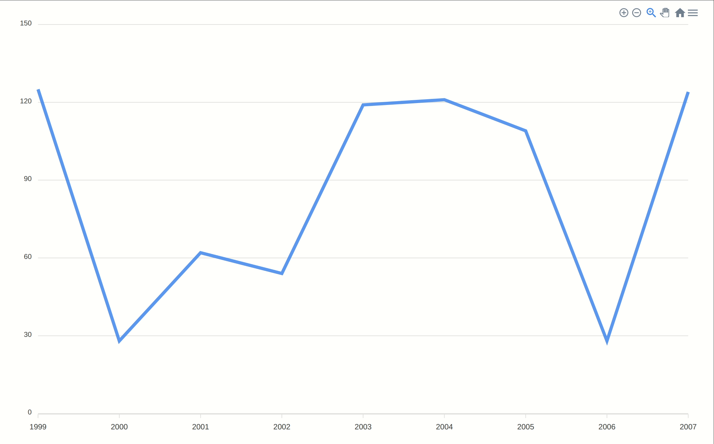

# Dart library for ApexCharts



## Using the library

### Install apexcharts
```html
<script src="https://cdn.jsdelivr.net/npm/apexcharts"></script>
```

### Install the library
```yaml
apexcharts:
    git:
      url: https://github.com/nigeltiany/apexcharts.git
      ref: master
```
